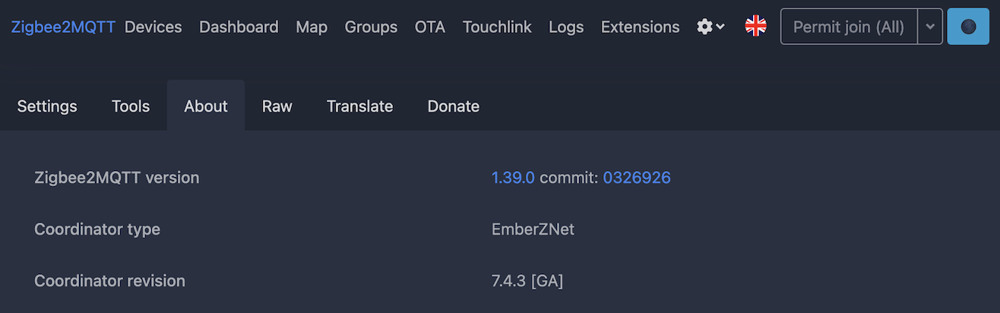
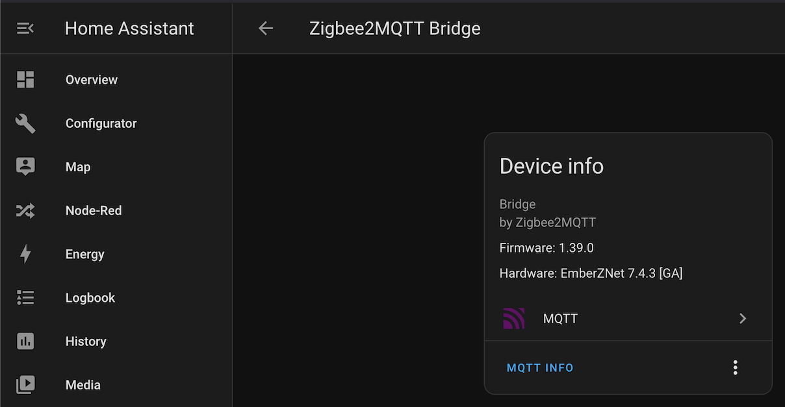

# SONOFF Zigbee 3.0 USB Dongle Plus firmware upgrading

This section contains a guidance and tools required to flash firmware to SONOFF [ZBDongle-E](https://itead.cc/product/zigbee-3-0-usb-dongle/) (based on EFR32MG21 chip) without a need of connecting a dongle to laptop and using tools like Flash Programmer 2.

The whole process was tested on a Raspberry Pi 4 running OSMC 2024.02-1 (based on Debian 11 "bullseye") alongside with zigbee2mqtt and Home Assistant, and should work on many recent Linux distributives as well.

## Original documentation

Here is the original documentation that was used in order to verify and confirm direct method of uploading firwmare to a dongle being connected to a Raspberry Pi:

 * https://sonoff.tech/product-review/how-to-use-sonoff-dongle-plus-on-home-assistant-how-to-flash-firmware/#5
 * https://sonoff.tech/wp-content/uploads/2023/02/SONOFF-Zigbee-3.0-USB-dongle-plus-firmware-flashing.pdf

In particular, the [uartLog.py](uartLog.py) script in this repository was originally downloaded from https://sonoff.tech/wp-content/uploads/2023/02/Auto-enter-bootloader.zip and slightly adapted for use on Linux hosts.
Original version of that script is here - [uartLog-original.py](uartLog-original.py).

Alternative instructions from zigbee2mqtt:

 * ZBDongle-E (EFR32MG21) - https://www.zigbee2mqtt.io/devices/ZBDongle-E.html
 * ZBDongle-P (CC2652P) - https://www.zigbee2mqtt.io/guide/adapters/flashing/flashing_via_cc2538-bsl.html

## Required software

The following software is required in order to proceed:

 * Python 3.x
 * [pyserial](https://pypi.org/project/pyserial/) and [gevent](https://pypi.org/project/gevent/) Python modules (on Debian you can install `python3-serial`
and `python3-gevent` packages to satisfy this requirement)
 * any serial client capable to deal with xmodem uploads - [minicom](https://man7.org/linux/man-pages/man1/minicom.1.html) is one of the available alternatives; make sure you also install the [lrzsz](https://packages.debian.org/search?keywords=lrzsz) package (on Debian) which provides actual support for xmodem transfers

To install all the prerequisites on OSMC/Debian, run this:
```
sudo apt-get install -y python3-serial python3-gevent minicom lrzsz
```

## Where to obtain firmware

You can use these sources to look for a firmware for your device:

 * https://github.com/itead/Sonoff_Zigbee_Dongle_Firmware
 * https://github.com/darkxst/silabs-firmware-builder

As a reference, the `ncp-uart-hw-v7.4.3.0-zbdonglee-115200.gbl` from https://github.com/darkxst/silabs-firmware-builder/raw/main/firmware_builds/zbdonglee/ncp-uart-hw-v7.4.3.0-zbdonglee-115200.gbl worked fine with ZBDongle-E and zigbee2mqtt v1.39.0 running with `ember` serial driver.

## How to upload firmware

1. Stop any software that interacts with SONOFF dongle via USB (like zigbee2mqtt and/or Home Assistant).

2. Run `uartLog.py` script (make sure your user has access to corresponding devices like `/dev/ttyACM0`) and enter a path to your device in order to put it in bootloader mode:
```
defan@rpi4-osmc:~$ ./uartLog.py
This is a debug log
This is an info log
This is critical
An error occurred

/dev/ttyACM0 - SONOFF Zigbee 3.0 USB Dongle Plus V2
/dev/ttyAMA0 - ttyAMA0
enter full device name: /dev/ttyACM0
>>>>>>>>>>>>>>>> /dev/ttyACM0 is opened.....
<queue.Queue object at 0xf6fca1c0>
<queue.Queue object at 0xf6fca358>
Write  processing...
Write  processing...
Read processing...
recv sp read tmplen  b'\r\nSonoff v1.0.1\r\n\x00\r\nGecko Bootloader v1.12.00\r\n1. upload gbl\r\n2. run\r\n3. ebl info\r\nBL > \x00'
<class 'bytes'>
Log Print processing...
<class 'bytes'>
2024-07-21 18:39:31.414537 [RX] : 0D 0A 53 6F 6E 6F 66 66 20 76 31 2E 30 2E 31 0D 0A 00 0D 0A 47 65 63 6B 6F 20 42 6F 6F 74 6C 6F 61 64 65 72 20 76 31 2E 31 32 2E 30 30 0D 0A 31 2E 20 75 70 6C 6F 61 64 20 67 62 6C 0D 0A 32 2E 20 72 75 6E 0D 0A 33 2E 20 65 62 6C 20 69 6E 66 6F 0D 0A 42 4C 20 3E 20 00
Sonoff v1.0.1

Gecko Bootloader v1.12.00
1. upload gbl
2. run
3. ebl info
BL >
>>>>>>>>>>>>>>>> end
```

[](https://asciinema.org/a/gKsSIyBKpWly3rzzZFfHqxU89)

3. Start `minicom` and make sure you are seeing bootloader prompt:
```
defan@rpi4-osmc:~$ minicom -o -D /dev/ttyACM0
[..]

Gecko Bootloader v1.12.00
1. upload gbl
2. run
3. ebl info
BL >
```

4. Press 1 to put bootloader into xmodem receiving mode.

5. Press Ctrl-A + S to initiate file sending dialog, choose xmodem, and point to the firmware file (you should have one on your host in advance).

6. Upload should complete without any errors; once it's done, press 2 to start the dongle, and then Ctrl-A + X to exit minicom.

[](https://asciinema.org/a/MI8y0zGLyvDb5k4fYq3GusD9v)

## How to verify firmware version after flashing

If you are using zigbee2mqtt, coordinator/router firmware version should be in its logs shortly after starting up:
```
defan@rpi4-osmc:/data$ docker logs z2m | fgrep -- 'z2m:' | head
[2024-07-21 20:42:18] info: 	z2m: Logging to console, file (filename: log.log)
[2024-07-21 20:42:18] info: 	z2m: Starting Zigbee2MQTT version 1.39.0 (commit #0326926)
[2024-07-21 20:42:18] info: 	z2m: Starting zigbee-herdsman (0.50.1)
[2024-07-21 20:42:21] info: 	z2m: zigbee-herdsman started (resumed)
[2024-07-21 20:42:21] info: 	z2m: Coordinator firmware version: '{"meta":{"build":0,"ezsp":13,"major":7,"minor":4,"patch":3,"revision":"7.4.3 [GA]","special":0,"type":170},"type":"EmberZNet"}'
[2024-07-21 20:42:21] info: 	z2m: Currently 7 devices are joined:
[..]
```

It should also be visible in zigbee2mqtt UI (Gear dropdown -> About):



Finally, in Home Assistant it should be available in Settings -> Devices -> Zigbee2MQTT Bridge:


